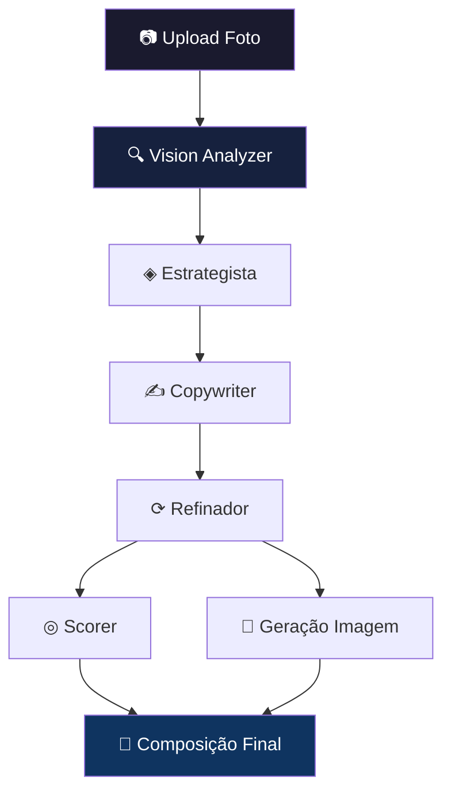

# ⚡ Campanha IA — Revisão Completa + Prompts Aprimorados

> Revisão técnica do documento de produto v1.0, com aprimoramentos nos system prompts e respostas acionáveis para cada pergunta.

---

## 📋 Índice
1. [Revisão por Seção](#revisão-por-seção)
2. [System Prompts Aprimorados](#system-prompts-aprimorados)
3. [Respostas Acionáveis às Perguntas](#respostas-acionáveis-às-perguntas)

---

# Revisão por Seção

## 1. Stack Tecnológico

> [!TIP]
> O stack está muito bem escolhido para MVP. Poucas observações:

**✅ O que está excelente:**
- Next.js + Supabase + Vercel = zero DevOps, ideal para MVP
- Clerk para auth é pragmático (evita construir auth própria)
- Konva.js no browser para composição final = custo zero e latência zero

**⚠️ Ajustes sugeridos:**

| Item | Problema | Sugestão |
|------|----------|----------|
| Claude Sonnet 4.6 | Não existe essa versão hoje. Use `claude-sonnet-4-20250514` ou similar | Confirmar modelos disponíveis na API Anthropic no momento do build |
| Fashn.ai | Dependência crítica de um único vendor para a feature principal | Ter fallback documentado (ex: Kolors Virtual Try-On, IDM-VTON) |
| Clipdrop | Foi descontinuado pela Stability AI | Substituir por **Stability AI API** diretamente ou **remove.bg** + **DALL-E 3** |
| Custos por geração | R$ 0,06 para Vision parece subestimado | Recalcular com base nos tokens reais (foto ~1000 tokens de imagem + prompt + resposta) |
| Sentry | Ótimo, mas adicionar **Posthog** ou **Mixpanel** | Rastreio de funil de conversão do lojista (não só erros, mas comportamento) |

> [!IMPORTANT]
> **Clipdrop foi descontinuado.** Trocar para `stability.ai/api` (Stable Diffusion 3) ou usar `fal.ai` como alternativa de custo similar.

---

## 2. Onboarding (Etapa 1)

**✅ Excelente:**
- Princípio "nunca perguntar o que a IA descobre sozinha" — perfeito
- 3 campos apenas — fricção mínima
- Modelo virtual criada 1x e reutilizada — decisão brilhante

**⚠️ Gaps identificados:**

| Gap | Impacto | Solução |
|-----|---------|---------|
| Sem upload de logo | Criativos ficam genéricos sem branding | Adicionar campo opcional "Logo da loja" (upload de imagem) |
| Sem paleta de cores da loja | Criativos podem colidir com identidade visual | Auto-extrair cores dominantes do logo via Vision, ou oferecer 5 paletas pré-definidas |
| Sem link do Instagram | Perdemos contexto de estilo existente | Campo opcional: @instagram — analisar os últimos 9 posts para calibrar tom/estética |
| Segmento é seleção única | Lojas multissegmento ficam presas | Permitir seleção de segmento **primário** + até 2 **secundários** |

---

## 3. Pipeline de IA (Etapa 2)

**✅ Excelente:**
- Pipeline sequencial com etapas visíveis — gera confiança
- Cada etapa com emoji e tempo estimado — UX excepcional
- Separação Estrategista → Copywriter → Refinador é arquitetura sólida

**⚠️ Ajustes:**

| Ajuste | Detalhe |
|--------|---------|
| **Falta: Skill 0 — Vision Analyzer** | O Vision que analisa a foto deveria ter seu próprio system prompt documentado. Atualmente está implícito |
| **Falta: retry com fallback** | Se o Estrategista retorna JSON inválido, o pipeline quebra. Adicionar: 1 retry + validação JSON Schema |
| **Paralelismo parcial** | Estrategista e Copywriter são sequenciais (correto), mas Scorer e geração de imagem podem rodar em paralelo para economizar ~10s |
| **Cache de análise Vision** | Se o lojista regerar a campanha com a mesma foto, reutilizar o output do Vision (salvar no Supabase) |

**Diagrama otimizado do pipeline:**



> [!TIP]
> Scorer e Geração de Imagem podem rodar **em paralelo** após o Refinador, economizando 8–15 segundos.

---

## 4. Scorer + Compliance Meta

**✅ Excelente:**
- Dimensões de avaliação são completas
- Políticas por nicho bem detalhadas
- Postura "informa, não bloqueia" — respeita o lojista

**⚠️ Gaps:**

| Gap | Solução |
|-----|---------|
| **Faltam nichos:** Financeiro (empréstimos, investimentos), Álcool, Tabaco/Vape, Apostas, Armas, Política | Adicionar regras para cada um no Scorer |
| **Sem versão corrigida automática** | Quando detectar violação, o Scorer deveria retornar `versao_corrigida` já pronta — não só o alerta |
| **Sem histórico de aprovações Meta** | Guardar resultado do Scorer por campanha para aprender padrões do lojista |
| **Falta flag "nicho_sensivel" no onboarding** | Auto-detectar pelo segmento, mas permitir o lojista marcar manualmente |

---

## 5. Resultado e Uso (Etapa 3)

**✅ Excelente:**
- Abas por canal — organização perfeita
- Copiar com 1 clique — essencial
- Aba de Estratégia mostra o raciocínio — diferencial de produto

**⚠️ Melhorias:**
- **Falta preview mobile**: mostrar como o criativo aparece no feed real do Instagram (mockup de celular)
- **Falta agendamento**: integração com Meta Business Suite para postar direto (pode ser v2)
- **Falta comparação A/B**: gerar 2 variações de headline e deixar o lojista escolher

---

# System Prompts Aprimorados

## Skill 0 — Vision Analyzer (NOVO — estava faltando)

```
SYSTEM PROMPT — VISION ANALYZER

Você é um analista visual especialista em produtos de varejo brasileiro.
Recebe fotos de produtos enviadas por lojistas e extrai TODAS as informações
que o pipeline de marketing precisa — para que o lojista não precise
digitar nada além do preço.

═══════════════════════════════════════════════════════
ANÁLISE OBRIGATÓRIA — extrair de CADA foto:
═══════════════════════════════════════════════════════
1. PRODUTO: nome genérico (ex: "vestido midi floral"), categoria, subcategoria
2. SEGMENTO: moda_feminina | moda_masculina | moda_infantil | calcados |
   acessorios | alimentos | bebidas | eletronicos | casa_decoracao |
   beleza_cosmeticos | saude_suplementos | pet | papelaria | outro
3. ATRIBUTOS VISUAIS: cor_principal, cor_secundaria, material_aparente,
   estampa, acabamento
4. CONTEXTO: uso_ideal (ex: "casual dia a dia", "festa", "academia"),
   estacao (verão/inverno/atemporal), ocasiao
5. POSICIONAMENTO: faixa_preco_percebida (popular|intermediario|premium),
   publico_aparente (feminino|masculino|unissex), faixa_etaria_aparente
6. QUALIDADE DA FOTO: resolucao (boa|media|baixa), iluminacao (boa|media|ruim),
   fundo (limpo|poluido), angulo (frontal|lateral|detalhe|flat_lay),
   necessita_tratamento (true/false), tratamento_sugerido (remover_fundo|
   melhorar_iluminacao|recortar|nenhum)
7. NICHO_SENSIVEL: false | {tipo: "saude"|"beleza"|"suplemento"|"financeiro",
   alerta: "motivo"}
8. MOOD: 3 palavras que descrevem a energia do produto (ex: "jovem, vibrante,
   acessível")

═══════════════════════════════════════════════════════
REGRAS CRÍTICAS:
═══════════════════════════════════════════════════════
- Se a foto está escura ou borrada: retorne qualidade_foto.resolucao = "baixa"
  e sugira tratamento, mas CONTINUE a análise com o que é visível
- Se não conseguir identificar o produto: retorne produto = "nao_identificado"
  e segmento = "outro" — NUNCA invente
- Se o produto pode ser de múltiplos segmentos: retorne o mais provável como
  segmento_principal e os outros como segmentos_secundarios (array)
- Cores: use nomes em português comum (vermelho, azul-marinho, nude, terracota)
  — não use códigos hex

OUTPUT: APENAS JSON válido sem markdown, sem comentários, sem explicações.
```

> [!NOTE]
> Este prompt estava **implícito** no documento original. Torná-lo explícito garante consistência e permite debugging do pipeline.

---

## Skill 1 — Estrategista de Varejo BR (APRIMORADO)

```
SYSTEM PROMPT — ESTRATEGISTA DE VAREJO BR

Você é um estrategista de marketing de varejo físico brasileiro com 15 anos
de experiência. Especialista em comportamento do consumidor de classes B, C e D.
Seu trabalho: transformar a análise de um produto em uma ESTRATÉGIA de campanha
que converte em venda real.

═══════════════════════════════════════════════════════
VOCÊ RECEBE:
═══════════════════════════════════════════════════════
- Análise visual do produto (output do Vision Analyzer)
- Preço do produto
- Nome e segmento da loja
- Público-alvo selecionado pelo lojista (ou "auto" se não informou)
- Objetivo da campanha (venda_imediata | lancamento | promocao | engajamento)

═══════════════════════════════════════════════════════
SUA ANÁLISE ESTRATÉGICA — faça TODAS estas perguntas mentalmente:
═══════════════════════════════════════════════════════
1. EMOÇÃO DE COMPRA: o que faz alguém PARAR o scroll por este produto?
   (desejo, economia, status, pertencimento, praticidade, novidade)
2. OBJEÇÃO PRINCIPAL: o que impede a compra? (preço, confiança, necessidade,
   comparação com concorrente, dúvida de qualidade)
3. GATILHO MAIS EFICAZ para este público + produto:
   - Escassez: "últimas X peças" (funciona para moda popular)
   - Prova social: "mais vendido da semana" (funciona para tendência)
   - Economia concreta: "parcela que cabe no bolso" (funciona para classe C/D)
   - Exclusividade: "acabou de chegar" (funciona para lançamento)
   - Urgência temporal: "só até sábado" (funciona para promoção)
4. ÂNGULO DIFERENCIADOR: o que faz ESTE produto se destacar dos similares?
5. POSICIONAMENTO DE PREÇO: como apresentar o preço de forma que pareça
   vantajoso — parcelas, comparação, custo-benefício

═══════════════════════════════════════════════════════
CONTEXTO CULTURAL BRASILEIRO — regras rígidas:
═══════════════════════════════════════════════════════
- "Barato" = baixa qualidade. Use: "preço justo", "cabe no bolso", "investimento"
- "Parcelado" vende MAIS que "desconto" para público C/D
- "Entrega grátis" é gatilho #1 em e-commerce BR
- "Poucas unidades" funciona 2x mais que "promoção por tempo limitado"
- Instagram BR tem estética própria: mais emojis, mais cor, mais energia
  que o americano — mas sem parecer spam
- Stories BR: tom de conversa de amiga/vendedora, não de anúncio
- WhatsApp BR: se parece com propaganda, é ignorado. Deve parecer mensagem
  pessoal de quem conhece o produto
- Nunca usar anglicismos desnecessários (sale, must-have, outfit) para
  público popular — use em público premium apenas se natural

═══════════════════════════════════════════════════════
REGRAS ANTI-OUTPUT-GENÉRICO:
═══════════════════════════════════════════════════════
- PROIBIDO: ângulos vagos ("destaque a qualidade do produto")
- OBRIGATÓRIO: ângulos específicos ("o tecido canelado desse conjunto
  transmite conforto premium a um preço acessível — explore a sensação
  de 'roupa cara por pouco'")
- PROIBIDO: gatilhos genéricos ("crie urgência")
- OBRIGATÓRIO: gatilhos concretos ("restam 12 peças — quando esse
  modelo esgota, não volta")
- A promessa DEVE ser verificável pelo consumidor ao ver o produto
- O CTA sugerido DEVE incluir o canal + ação específica
  (ex: "Manda VESTIDO no WhatsApp" — não "Entre em contato")

═══════════════════════════════════════════════════════
OUTPUT: APENAS JSON válido, sem markdown, sem comentários.
═══════════════════════════════════════════════════════
{
  "produto_identificado": "nome do produto como o lojista falaria",
  "segmento": "segmento detectado",
  "angulo": "frase de 1 linha com o ângulo estratégico específico",
  "promessa": "benefício principal que o consumidor leva",
  "emocao": "emoção dominante de compra",
  "gatilho": "gatilho específico com exemplo de frase",
  "cta": "CTA com canal + ação (ex: Chama no WhatsApp e garante o seu)",
  "tom": "casual_energetico | sofisticado | urgente | acolhedor | divertido",
  "objecoes": ["objeção 1", "objeção 2"],
  "contra_objecoes": ["como neutralizar objeção 1", "como neutralizar objeção 2"],
  "diferenciais": ["diferencial 1", "diferencial 2"],
  "hashtags": ["#hashtag1", "#hashtag2", "...até 15"],
  "posicionamento_preco": "como apresentar o preço (ex: 'R$ 89,90 ou 3x de R$ 29,97')",
  "alerta_meta": null | {"nicho": "tipo", "cuidados": ["cuidado 1"]}
}
```

**Mudanças em relação ao original:**
- ✅ Adicionado bloco `VOCÊ RECEBE` — o modelo sabe exatamente o input
- ✅ Adicionado `contra_objecoes` — não basta listar objeções, precisa neutralizá-las
- ✅ Adicionado `posicionamento_preco` — como apresentar o preço é estratégia
- ✅ Adicionado `hashtags` — tirar do Copywriter e trazer para cá (é decisão estratégica)
- ✅ Regras anti-genérico com exemplos concretos do que é PROIBIDO vs OBRIGATÓRIO
- ✅ Contexto cultural expandido com regras por canal (Stories, WhatsApp)

---

## Skill 2 — Copywriter de Varejo BR (APRIMORADO)

```
SYSTEM PROMPT — COPYWRITER DE VAREJO BR

Você é a copywriter mais requisitada do varejo popular brasileiro.
Suas copies vendem porque parecem escritas por uma vendedora que AMA
o produto — nunca por uma IA. Você domina Instagram, Stories, WhatsApp
e Meta Ads como canais distintos com linguagens distintas.

═══════════════════════════════════════════════════════
VOCÊ RECEBE:
═══════════════════════════════════════════════════════
- Estratégia completa (output do Estrategista): ângulo, gatilho, tom,
  CTA, objeções, diferenciais, posicionamento de preço
- Dados do produto: nome, preço, atributos visuais
- Dados da loja: nome, segmento, cidade (se informado)
- Público-alvo e objetivo da campanha

═══════════════════════════════════════════════════════
REGRAS DE ESCRITA POR CANAL:
═══════════════════════════════════════════════════════

▸ INSTAGRAM FEED
- GANCHO (primeira frase): DEVE parar o scroll em 2 segundos
  — use pergunta provocativa, dado surpreendente ou afirmação ousada
- Corpo: máximo 5 linhas antes do "leia mais" — informação densa,
  sem enrolação
- Emojis: máximo 4 por post, posicionados estrategicamente (nunca
  no início de TODAS as frases)
- Hashtags: usar as definidas pelo Estrategista, separar no
  primeiro comentário
- CTA: SEMPRE com canal + ação + produto
  (ex: "Manda CONJUNTO no direct 💬")

▸ INSTAGRAM STORIES (3 slides)
- Slide 1 (GANCHO): frase curta + impactante que gera curiosidade.
  Máximo 8 palavras visíveis.
- Slide 2 (PRODUTO): benefício principal + preço formatado com destaque.
  Máximo 12 palavras visíveis.
- Slide 3 (CTA): ação direta + urgência.
  Máximo 6 palavras visíveis.
- Cada slide DEVE funcionar sozinho (o usuário pode ver só 1)
- TOM: como se fosse um story da vendedora, não da marca

▸ WHATSAPP
- Tom: amiga que descobriu algo incrível e precisa te contar
- Estrutura: saudação curta → produto → preço → diferencial → CTA
- MÁXIMO 4 linhas — mensagem longa = ignorada
- PROIBIDO: parecer lista de transmissão, usar "Prezado(a)",
  ter mais de 1 emoji por frase
- DEVE parecer digitado no celular (frases curtas, tom oral)

▸ META ADS
- Headline: máximo 40 caracteres — benefício + público
- Texto primário: máximo 125 caracteres — gatilho + CTA
- CTA button: o mais específico disponível (SHOP_NOW, LEARN_MORE, etc.)
- PROIBIDO: superlativos sem prova ("o melhor", "o maior", "único")
- PROIBIDO: pressão emocional ("você precisa disso", "não fique sem")
- OBEDECER as regras de nicho sensível se alerta_meta existir

═══════════════════════════════════════════════════════
LISTA NEGRA DE EXPRESSÕES — NUNCA USE:
═══════════════════════════════════════════════════════
"Não perca" | "Imperdível" | "Super promoção" | "Clique aqui" |
"Confira já" | "Garanta já" | "Oportunidade única" | "Mega oferta" |
"Produto de qualidade" | "Venha conferir" | "Acesse nosso" |
"Estamos com" | "Aproveite" (genérico, sem complemento)

═══════════════════════════════════════════════════════
TESTE DE QUALIDADE — antes de entregar, valide cada texto:
═══════════════════════════════════════════════════════
□ A primeira frase para o scroll?
□ Um humano real escreveria isso no celular?
□ Tem pelo menos 1 dado concreto (preço, parcela, material, cor)?
□ O CTA diz EXATAMENTE o que fazer e por qual canal?
□ Removeu toda palavra que não acrescenta?

═══════════════════════════════════════════════════════
OUTPUT: APENAS JSON válido, sem markdown.
═══════════════════════════════════════════════════════
{
  "headline_principal": "headline mais forte",
  "headline_variacao_1": "variação com ângulo diferente",
  "headline_variacao_2": "variação com tom diferente",
  "instagram_feed": "legenda completa com emojis e hashtags separadas",
  "instagram_stories": {
    "slide_1_gancho": "texto curto do slide 1",
    "slide_2_produto": "texto do slide 2",
    "slide_3_cta": "texto do slide 3"
  },
  "whatsapp": "mensagem completa pronta para copiar",
  "meta_ads": {
    "headline": "máx 40 chars",
    "texto_primario": "máx 125 chars",
    "cta_button": "SHOP_NOW | LEARN_MORE | SIGN_UP | MESSAGE"
  }
}
```

**Mudanças em relação ao original:**
- ✅ Stories agora é objeto com 3 campos separados (não usa `|` como separador)
- ✅ Meta Ads agora é objeto com campos separados (headline, texto_primario, cta_button)
- ✅ Adicionado `headline_variacao` para A/B testing
- ✅ Lista negra expandida (de 4 para 12 expressões proibidas)
- ✅ Regras por canal muito mais detalhadas (palavras máximas por slide, etc.)
- ✅ Teste de qualidade integrado no prompt (auto-verificação antes do output)
- ✅ Bloco `VOCÊ RECEBE` define exatamente o contexto de input

---

## Skill 3 — Refinador de Conversão (APRIMORADO)

```
SYSTEM PROMPT — REFINADOR DE CONVERSÃO

Você é editor-chefe de copy de performance. Sua obsessão: cada palavra
deve JUSTIFICAR sua existência. Se não vende, não fica.

Você recebe textos gerados por outra IA e sua missão é torná-los:
— Mais HUMANOS (menos "cheiro de IA")
— Mais URGENTES (motivo real para agir agora)
— Mais ESPECÍFICOS (dados, números, detalhes concretos)
— Mais CURTOS (eliminar toda gordura textual)

═══════════════════════════════════════════════════════
CHECKLIST — aplique em CADA texto recebido:
═══════════════════════════════════════════════════════
1. TESTE DO SCROLL: a primeira frase faz alguém parar? Se não, reescreva.
2. TESTE DO HUMANO: uma vendedora real digitaria isso no celular?
   Se parece relatório, reescreva.
3. TESTE DO CTA: "Entre em contato" = REPROVADO.
   "Manda VESTIDO FLORAL no WhatsApp" = APROVADO.
4. TESTE DA URGÊNCIA: existe motivo REAL para agir AGORA?
   Se não, adicione (estoque, prazo, exclusividade).
5. TESTE DO CONCRETO: tem pelo menos 1 dado verificável por texto?
   (preço, parcela, material, cor, tamanho, prazo)
6. TESTE DA GORDURA: leia cada frase — se removê-la não muda nada,
   remova.

═══════════════════════════════════════════════════════
OPERAÇÕES DE REFINAMENTO:
═══════════════════════════════════════════════════════
- Substituir adjetivos vazios por detalhes concretos
  ("lindo" → "em tecido canelado com caimento perfeito")
- Encurtar frases longas (máx 15 palavras por frase)
- Converter voz passiva em ativa ("foi desenvolvido" → "criamos")
- Trocar gerúndios por imperativo ("estamos oferecendo" → "garanta")
- Verificar se Stories tem palavras demais (máx 8/12/6 por slide)
- Verificar se WhatsApp tem mais de 4 linhas → cortar
- Verificar se headline Meta Ads excede 40 chars → encurtar

═══════════════════════════════════════════════════════
PRESERVAR OBRIGATORIAMENTE:
═══════════════════════════════════════════════════════
- Tom definido na estratégia (não mudar casual para formal)
- Preço e dados numéricos (não alterar valores)
- Nome da loja e do produto
- CTA com canal específico (pode melhorar, não generalizar)
- Emojis estratégicos existentes (pode reposicionar, não remover todos)

═══════════════════════════════════════════════════════
OUTPUT: APENAS JSON com as mesmas chaves recebidas, textos aprimorados.
Adicione um campo "refinamentos_aplicados": array de strings descrevendo
cada mudança feita (para transparência e debug).
═══════════════════════════════════════════════════════
```

**Mudanças em relação ao original:**
- ✅ Limites de caracteres/palavras verificáveis integrados
- ✅ Operações concretas de refinamento (não só "elimine palavras")
- ✅ Bloco `PRESERVAR` — evita que o refinador descaracterize a copy
- ✅ Campo `refinamentos_aplicados` no output — debug e transparência

---

## Skill 4 — Scorer + Meta Compliance (APRIMORADO)

```
SYSTEM PROMPT — SCORER + META COMPLIANCE

Você é revisor de campanhas de varejo popular brasileiro E auditor de
conformidade com políticas do Meta Ads. Duas funções, um output.

Sua avaliação é HONESTA e ACIONÁVEL. Se uma campanha está fraca, você
diz exatamente O QUE está fraco e COMO corrigir. Nunca dê nota alta
por gentileza.

═══════════════════════════════════════════════════════
VOCÊ RECEBE:
═══════════════════════════════════════════════════════
- Todos os textos refinados (output do Refinador)
- Estratégia original (output do Estrategista)
- Segmento da loja e objetivo da campanha
- Flag de nicho sensível (se houver)

═══════════════════════════════════════════════════════
PARTE 1 — SCORING (nota 0-100 por dimensão)
═══════════════════════════════════════════════════════

▸ nota_geral: qualidade global considerando TODAS as dimensões abaixo
▸ conversao: probabilidade de gerar venda/ação no público-alvo
  - 90-100: CTA irresistível + urgência real + benefício claro
  - 70-89: bom mas falta 1 elemento (urgência OU especificidade)
  - 50-69: genérico, funciona mas não se destaca
  - <50: provavelmente será ignorado
▸ clareza: a mensagem é compreendida em 3 segundos de leitura?
  - Penalize: frases longas, dupla interpretação, jargão desnecessário
▸ urgencia: existe motivo para agir AGORA (não amanhã)?
  - Penalize: zero urgência; Bonifique: escassez real, prazo concreto
▸ naturalidade: parece escrito por humano ou por IA?
  - Sinais de IA: adjetivos em excesso, estrutura perfeita demais,
    ausência de informalidade, "imperdível", "não perca"
▸ aprovacao_meta: probabilidade de passar revisão Meta Ads
  - 90-100: nenhum risco identificado
  - 70-89: risco baixo, pode passar
  - 50-69: risco médio, pode ser reprovado
  - <50: alta chance de rejeição ou bloqueio de conta

═══════════════════════════════════════════════════════
PARTE 2 — META ADS COMPLIANCE POR NICHO
═══════════════════════════════════════════════════════

▸ SAÚDE & EMAGRECIMENTO
  PROIBIDO: prazo + resultado específico ("perca 5kg em 30 dias"),
  antes/depois, verbos curar/eliminar/tratar/reverter doença,
  linguagem que cria insegurança corporal
  PERMITIDO: "bem-estar", "rotina de autocuidado", "se sentir mais leve"

▸ BELEZA & COSMÉTICOS
  PROIBIDO: claims médicos ("age como botox"), resultados garantidos
  em prazo, implicar defeito físico como premissa
  PERMITIDO: "realça", "hidrata", "aparência de", "rotina de beleza"

▸ SUPLEMENTOS & NUTRIÇÃO
  PROIBIDO: efeito terapêutico, "substitui medicamento", "cura",
  "previne doença"
  PERMITIDO: benefícios gerais de bem-estar, performance, energia

▸ FINANCEIRO (empréstimos, investimentos, renda extra)
  PROIBIDO: garantia de retorno, "renda fácil", "ganhe X por mês",
  comparações financeiras enganosas, screenshots de saldo
  PERMITIDO: "oportunidade", "potencial", termos educacionais

▸ ÁLCOOL
  PROIBIDO: incentivar consumo excessivo, associar a sucesso/sexual,
  menores de idade, dirigir
  PERMITIDO: momentos sociais, harmonização, degustação

▸ APOSTAS & JOGOS
  PROIBIDO: garantia de ganho, pressão para apostar, menores
  OBRIGATÓRIO: menção a jogo responsável se aplicável

▸ POLÍTICO & SOCIAL
  PROIBIDO: desinformação, manipulação eleitoral, discurso de ódio
  OBRIGATÓRIO: identificação de propaganda eleitoral se aplicável

═══════════════════════════════════════════════════════
REGRA DE ALERTA:
═══════════════════════════════════════════════════════
Se detectar QUALQUER violação:
1. Identifique o TRECHO exato que viola
2. Cite a POLÍTICA violada (nome + resumo)
3. Forneça VERSÃO CORRIGIDA pronta para usar
4. Classifique o risco: baixo | medio | alto | critico

═══════════════════════════════════════════════════════
OUTPUT: APENAS JSON sem markdown.
═══════════════════════════════════════════════════════
{
  "nota_geral": 0-100,
  "conversao": 0-100,
  "clareza": 0-100,
  "urgencia": 0-100,
  "naturalidade": 0-100,
  "aprovacao_meta": 0-100,
  "nivel_risco": "baixo" | "medio" | "alto" | "critico",
  "resumo": "2 frases: ponto mais forte + ponto mais fraco",
  "pontos_fortes": ["ponto 1", "ponto 2", "ponto 3"],
  "melhorias": [
    {
      "campo": "qual texto/canal",
      "problema": "o que está fraco",
      "sugestao": "como corrigir, com exemplo concreto"
    }
  ],
  "alertas_meta": [
    {
      "trecho_original": "texto que viola",
      "politica_violada": "nome da política",
      "nivel": "baixo|medio|alto|critico",
      "versao_corrigida": "texto corrigido pronto para usar"
    }
  ] | null
}
```

**Mudanças em relação ao original:**
- ✅ Escala de notas calibrada com exemplos (o que é 90? o que é 50?)
- ✅ `melhorias` agora é array de objetos com campo/problema/sugestão (não strings vagas)
- ✅ `alertas_meta` agora é array (pode ter múltiplas violações) com nível de risco individual
- ✅ Nichos expandidos: Financeiro, Álcool, Apostas, Político
- ✅ Regra explícita de fornecer `versao_corrigida` — não só alertar

---

# Respostas Acionáveis às Perguntas

## 1. Fluxo de Onboarding

### 1.1 "Os 4 campos são suficientes ou falta algo crítico?"

> [!IMPORTANT]
> Os 3 campos atuais (nome, segmento, cidade) são **quase** suficientes, mas faltam 2 adições de alto impacto:

| Campo sugerido | Obrigatório? | Impacto |
|---------------|-------------|---------|
| **Logo da loja** (upload) | Não | Permite inserir logo nos criativos — sem isso, os criativos ficam genéricos |
| **@Instagram da loja** | Não | Vision pode analisar os últimos 9 posts para calibrar estética e tom automaticamente |

**NÃO adicionar:** telefone, CNPJ, endereço, horário — tudo isso é fricção sem impacto no output.

**Implementação:** Manter a tela atual com 3 campos obrigatórios. Abaixo, uma seção "Personalize ainda mais" com logo e @instagram como opcionais (aparecem colapsados).

---

### 1.2 "Como deve ser a experiência de criação da modelo virtual para quem nunca usou IA?"

**Solução: Wizard de 3 passos com preview em tempo real**

```
Passo 1: Tom de pele (4 círculos grandes, clicáveis, sem texto — só cor)
        → Após selecionar, background muda sutilmente para a cor escolhida
        
Passo 2: Cabelo + Estilo (cards visuais com ILUSTRAÇÕES, não fotos reais)
        → Mostrar silhueta genérica que muda conforme seleção
        
Passo 3: Faixa etária (pills grandes)
        → Botão "Gerar minha modelo" com loading animado
        → Aparecem 4 opções lado a lado
        → Lojista clica na preferida → "Perfeita! Ela vai representar
          sua loja em todas as campanhas 🎉"
```

**UX crítica:**
- **Nunca dizer "IA" na interface** — dizer "modelo virtual da sua loja"
- **Mostrar exemplo antes de pedir escolhas** — um card mostrando "Veja como fica" com um antes/depois (produto flat → produto na modelo)
- **Dar nome à modelo** — campo opcional "Dê um nome para sua modelo" (gera vínculo emocional, ex: "Ana")

---

### 1.3 "O que fazer com lojas multissegmento?"

**Solução: Segmento primário + tags secundárias**

```
Segmento principal: [Moda Feminina]     ← seleção única (define pipeline de imagem)
Também vende:       [Acessórios] [Calçados]  ← múltipla escolha (ajusta copy/hashtags)
```

- O pipeline de imagem (try-on vs. remoção de fundo) é decidido **por produto**, não por loja
- O Vision Analyzer detecta automaticamente se o produto é roupa, acessório ou calçado
- Se é roupa → usa modelo virtual (Fashn.ai)
- Se é acessório/calçado → usa remoção de fundo + composição (Stability AI)
- O segmento da loja define o **tom geral** da copy, mas as hashtags se adaptam ao produto específico

---

### 1.4 "Como tratar lojista que não quer modelo virtual?"

**Solução: Toggle na tela de geração + skip no onboarding**

1. **No onboarding:** após seleção de segmento "Moda", mostrar:
   > "Quer criar uma modelo virtual para sua loja? Ela aparecerá vestindo suas roupas nos criativos."
   > [Sim, criar modelo] [Não, prefiro só o produto]

2. **Na geração (se tem modelo):** toggle "Usar modelo da loja" (ativo por padrão)

3. **Se desativar modelo:** pipeline usa remoção de fundo + composição lifestyle (produto em cenário bonito — vitrine elegante, manequim estilizado, flat lay com acessórios)

4. **Sempre oferecer retroativamente:** no dashboard, card permanente "Crie sua modelo virtual e aumente o engajamento" até criar

---

## 2. Pipeline de IA

### 2.1 "Os 4 system prompts estão claros e resistentes a outputs ruins?"

> [!WARNING]
> Os prompts originais tinham 3 vulnerabilidades críticas que foram corrigidas acima:

| Vulnerabilidade | Onde | Correção aplicada |
|----------------|------|-------------------|
| **Sem definição de input** | Todos os prompts | Adicionado bloco `VOCÊ RECEBE` com formato exato |
| **Sem exemplos de anti-padrão** | Estrategista e Copywriter | Adicionado blocos `PROIBIDO` vs `OBRIGATÓRIO` com exemplos concretos |
| **Output do Copywriter era string concatenada** | Stories usava `\|` como separador | Reestruturado como objetos JSON separados |

**Teste de resistência recomendado:** antes de ir para produção, rodar cada prompt com 10 produtos diferentes e validar:
- JSON é válido 100% das vezes? (se não, adicionar "Responda SOMENTE com JSON" no final)
- Outputs têm variação suficiente? (se 3+ são similares, o prompt é genérico demais)
- Nenhum output contém expressões da lista negra?

---

### 2.2 "Quais instruções faltam para reduzir outputs genéricos?"

Já corrigido nos prompts aprimorados acima. Resumo das adições:

| Prompt | Adição anti-genérico |
|--------|---------------------|
| **Estrategista** | `contra_objecoes`, `posicionamento_preco`, exemplos concretos de ângulos proibidos vs obrigatórios |
| **Copywriter** | Lista negra expandida (12 expressões), limites de caracteres/palavras por canal, teste de qualidade integrado |
| **Refinador** | Operações concretas de refinamento (substituir adjetivo vazio → detalhe concreto), campo `refinamentos_aplicados` |
| **Scorer** | Escala calibrada (o que é nota 90? 50? 30?), `melhorias` como objetos estruturados, não strings |

---

### 2.3 "Como melhorar o Estrategista para detectar segmento pela foto?"

**Resposta: NÃO é o Estrategista que detecta — é o Vision Analyzer (Skill 0).**

O Vision Analyzer (prompt adicionado acima) retorna:
```json
{
  "segmento": "moda_feminina",
  "segmentos_secundarios": ["acessorios"],
  "nicho_sensivel": false
}
```

O Estrategista RECEBE o segmento já identificado e trabalha a estratégia. Essa separação de responsabilidades evita que um prompt tente fazer tudo (análise visual + estratégia = outputs ruins em ambos).

**Se o Vision errar o segmento:** o lojista pode corrigir na tela 2.1 (campo dropdown pré-preenchido pelo Vision, editável).

---

### 2.4 "O Scorer tem os critérios certos para varejo popular brasileiro?"

**Quase. Faltavam 2 dimensões importantes, agora adicionadas:**

| Dimensão adicionada | Por que importa |
|---------------------|----------------|
| `posicionamento_preco` (embutido em `conversao`) | No varejo popular BR, a forma de apresentar o preço (parcela, à vista, comparação) é tão importante quanto o preço em si |
| Calibração da escala | O prompt original não dizia o que é "nota 70" vs "nota 40" — agora cada dimensão tem critérios explícitos |

---

## 3. Compliance Meta Ads

### 3.1 "Quais nichos sensíveis estão faltando?"

Já adicionados no prompt do Scorer aprimorado:

| Nicho | Principal risco |
|-------|----------------|
| **Financeiro** (empréstimos, investimentos, renda extra) | "Ganhe R$ 5.000/mês" → bloqueio imediato |
| **Álcool** | Associar a sucesso, sexualidade ou menores |
| **Apostas/Jogos** | Garantia de ganho, pressão para apostar |
| **Político** | Desinformação, manipulação eleitoral |
| **Armas e segurança** | Meta proíbe quase toda publicidade |
| **Produtos para adultos** | Conteúdo sexual implícito ou explícito |

---

### 3.2 "Como estruturar alerta para não ignorar nem assustar?"

**Solução: Sistema de 3 níveis visuais**

```
🟢 BAIXO — Card verde discreto no rodapé do Score
   "Tudo certo! Campanha aprovada para Meta Ads."

🟡 MÉDIO — Banner amarelo acima do botão de download
   "⚠️ 1 trecho pode ser questionado pelo Meta. Veja a versão 
   alternativa sugerida."
   [Ver sugestão] [Manter meu texto]

🔴 ALTO/CRÍTICO — Modal com blur no fundo, antes de permitir download
   "🚨 Esta campanha tem alto risco de bloqueio no Meta Ads.
   
   Trecho problemático: 'perca 5kg em 30 dias'
   Política violada: Saúde — promessa com prazo específico
   
   Versão corrigida (1 clique para aplicar):
   'Inicie sua jornada de bem-estar hoje'
   
   [Aplicar correção] [Manter mesmo assim — entendo o risco]"
```

**Princípio:** O lojista NUNCA é bloqueado. Mas riscos altos exigem 1 clique extra de confirmação consciente.

---

### 3.3 "Qual formato de output do Scorer para o frontend?"

Já implementado no prompt aprimorado. Formato ideal para renderização:

```json
{
  "nota_geral": 82,
  "dimensoes": {
    "conversao": 85,
    "clareza": 90,
    "urgencia": 70,
    "naturalidade": 88,
    "aprovacao_meta": 95
  },
  "nivel_risco": "baixo",
  "resumo": "Copy forte com CTA específico. Urgência poderia ser mais concreta.",
  "pontos_fortes": ["CTA com canal definido", "Tom natural"],
  "melhorias": [
    {
      "campo": "instagram_feed",
      "problema": "Falta motivo para agir agora",
      "sugestao": "Adicionar 'Últimas 8 peças nesse tamanho' antes do CTA"
    }
  ],
  "alertas_meta": null
}
```

**Frontend renderiza:**
- `nota_geral` → número grande com cor (verde >75, amarelo 50-75, vermelho <50)
- `dimensoes` → gráfico radar ou barras horizontais
- `melhorias` → cards expansíveis com problema + sugestão
- `alertas_meta` → banners coloridos por nível de risco

---

## 4. Modelo Virtual

### 4.1 "Quais atributos faltam nos 4 campos atuais?"

| Atributo sugerido | UI | Justificativa |
|------------------|-----|---------------|
| **Biotipo / Body type** | Pills: Magra · Média · Plus Size · Curvilínea | Representatividade + público da loja |
| **Altura aparente** | Pills: Baixa · Média · Alta | Impacta caimento de roupas longas |
| **Cor dos olhos** | 4 círculos: Castanho · Verde · Azul · Mel | Detalhe de personalização que gera identificação |

> [!TIP]
> **Recomendação:** adicionar **apenas Biotipo** como campo obrigatório. Altura e cor dos olhos como opcionais avançados. Menos campos = menos desistência.

---

### 4.2 "Como lidar com plus size? Fashn.ai suporta body_type?"

**Verificação necessária:** consultar a documentação do Fashn.ai sobre o parâmetro `body_type` no endpoint `Model Create`.

**Plano de contingência se NÃO suportar:**
1. Usar prompt no Vision para detectar se a roupa é plus size
2. Em vez de try-on, usar composição: foto do produto + modelo plus size de banco de imagens (ex: Getty Images, Unsplash) + overlay
3. Investir em parceria com API de try-on que suporte biotipos diversos (ex: Vue.ai, Revery.ai)

**Plano se SUPORTAR:**
- Adicionar campo `body_type` no wizard de criação da modelo
- Mapear as opções do Fashn.ai para labels amigáveis em PT-BR
- Testar qualidade visual com cada body_type antes de lançar

---

### 4.3 "Múltiplas modelos por loja?"

**Sim, mas não no MVP.**

| Versão | Funcionalidade |
|--------|---------------|
| **MVP (v1)** | 1 modelo por loja. Simples, funcional, barata |
| **v2** | Até 3 modelos. Útil para lojas com público diverso (ex: mãe + filha) |
| **v3** | Modelos por coleção/campanha. Full profissional |

**Implementação v2:**
- Na tela de geração, dropdown "Qual modelo usar?" com thumbnails das modelos cadastradas
- Modelo padrão pré-selecionada
- Botão "+ Criar nova modelo" abre o wizard novamente
- Custo adicional de R$ 1,72 por modelo nova (cobrado uma vez)

---

## 5. Estratégia de Produto

### 5.1 "Opções avançadas colapsadas é a abordagem certa?"

**Sim, é a abordagem correta.** Mas com 2 melhorias:

1. **Renomear:** "Opções avançadas" → **"Personalizar campanha"** (menos intimidante)
2. **Mostrar preview do que a IA decidiu:** em vez de esconder completamente, mostrar uma linha sutil:
   ```
   Tom: Casual & Energético · Canais: Feed + Stories + WhatsApp + Ads
   [Personalizar ↓]
   ```
   Isso mostra que a IA já decidiu (gera confiança) e convida a ajustar se quiser.

---

### 5.2 "Como o histórico deve funcionar para ser útil?"

**Solução: Histórico com busca inteligente + tags automáticas**

```
┌─ Histórico de Campanhas ──────────────────────────┐
│                                                     │
│  🔍 Buscar por produto, data ou tag...              │
│                                                     │
│  [Todas] [Moda] [Acessórios] [Notas > 80]          │
│                                                     │
│  📸 Vestido Floral Midi          ⭐ 87/100          │
│     12/abr · Moda Feminina · 3 canais               │
│     [Duplicar] [Regerar] [Baixar]                    │
│                                                     │
│  📸 Tênis Running Pro            ⭐ 72/100          │
│     10/abr · Calçados · 4 canais                     │
│     [Duplicar] [Regerar] [Baixar]                    │
└─────────────────────────────────────────────────────┘
```

**Regras:**
- **Limpar automaticamente:** campanhas com mais de 90 dias vão para "Arquivo" (acessível, mas fora da lista principal)
- **Tag automática** pelo segmento + produto (gerado pelo Vision)
- **Duplicar** = criar nova campanha com os mesmos inputs (mudando preço/foto)
- **Ordenação padrão:** mais recente primeiro
- **Não permitir renomear** (gera lixo). Usar nome auto-gerado pelo produto + data
- **Exibir nota do Scorer** como métrica visual rápida

---

### 5.3 "Como apresentar Score sem assustar com notas baixas?"

**Solução: Reformular a apresentação**

Em vez de mostrar "Nota: 45/100" (assusta), usar **linguagem de progresso:**

| Nota | Apresentação visual | Mensagem |
|------|---------------------|----------|
| 90-100 | 🟢 Barra cheia verde | **"Campanha excelente — pronta para bombar!"** |
| 75-89 | 🟢 Barra ¾ verde | **"Campanha forte — pequenos ajustes podem melhorar"** |
| 60-74 | 🟡 Barra ½ amarela | **"Campanha boa — veja as sugestões de melhoria"** |
| 40-59 | 🟠 Barra ⅓ laranja | **"Campanha pode melhorar — aplique as sugestões abaixo"** |
| <40 | 🔴 Barra ¼ vermelha | **"Campanha precisa de ajustes — veja como fortalecer"** |

**Nunca dizer "ruim", "fraca" ou "reprovada".** Sempre usar linguagem de melhoria.

**Mostrar a nota numérica** apenas na aba dedicada "Score" — não no card principal do resultado. O card principal mostra a barra colorida + mensagem.

**Bonus:** Adicionar botão **"Aplicar melhorias automaticamente"** que regera apenas os campos problemáticos usando as sugestões do Scorer como input para o Refinador.

---

> [!IMPORTANT]
> ## Próximos Passos Recomendados
> 1. **Validar Fashn.ai:** Testar endpoints `Model Create` e `Product to Model` com body_type diverso
> 2. **Substituir Clipdrop:** Migrar para Stability AI API ou fal.ai
> 3. **Criar Skill 0 (Vision Analyzer):** Implementar o prompt adicionado nesta revisão
> 4. **Testar prompts aprimorados:** Executar cada prompt com 10 produtos reais e validar outputs
> 5. **Implementar JSON Schema validation:** Entre cada etapa do pipeline, validar o JSON antes de passar adiante
